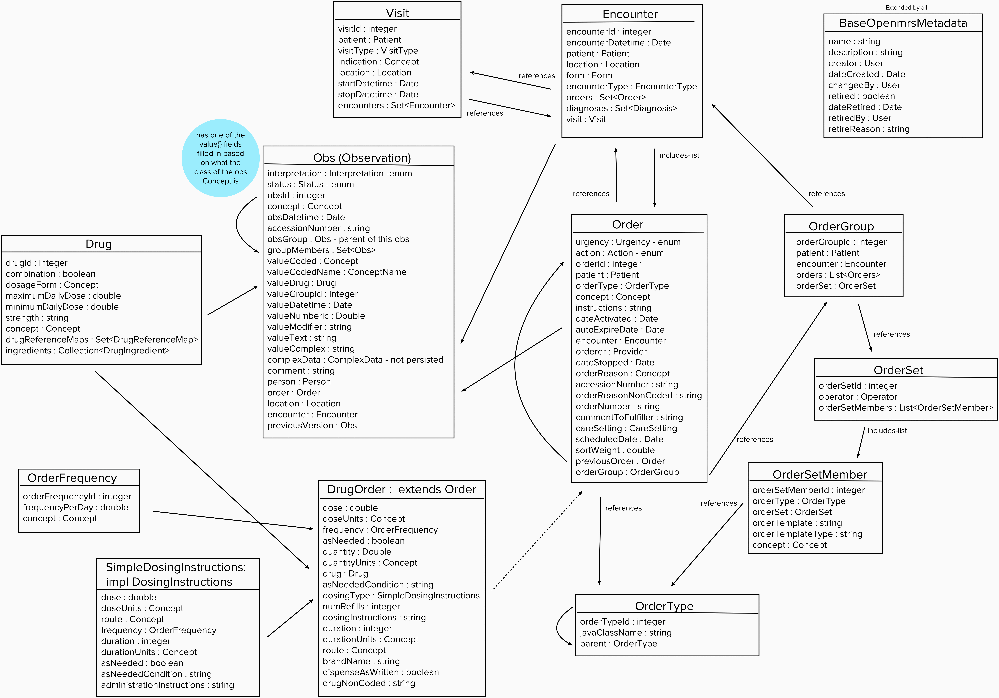

OpenMRS 2.1.3 Mirebalais: Oncology Regimen Ordering & Dashboard Support
=======================================================================

- [OpenMRS 2.1.3 Mirebalais: Oncology Regimen Ordering & Dashboard Support](#openmrs-213-mirebalais--oncology-regimen-ordering---dashboard-support)
  * [Purpose](#purpose)
  * [Context](#context)
  * [Assumptions](#assumptions)
- [Functional Requirements](#functional-requirements)
- [Use Cases](#use-cases)
- [API Flows](#api-flows)
  * [UC1 API Flow](#uc1-api-flow)
  * [Sequence Diagram](#sequence-diagram)
  * [UC2 API Flow](#uc2-api-flow)
- [Proposal](#proposal)
- [Extended Content](#extended-content)
- [Technical TODOs/Open Issues](#technical-todos-open-issues)

Purpose
-------

This document captures options gathered during first week of discussions about how to implement ordering of oncology (chemo specifcally) treatment regimens within OpenMRS Mirebalais distro and provide dashboard analytics about their treatment.

Context
-------

This capability is being added as part of a 3-week on-site engagement between PIH and IBM teams. The goal is to provide a completed set of features for use with Mirebalais distro. 

The scope was focused on doctor-centric workflow during initial consultation/diagnosis of a cancer patient which requires doctor order chemotherapy treatment which is likely to be recurring and re-validated during each cycle visit.

This doctor workflow's use cases are not currently part of Mirebalais distro are:
- Order a chemo treatment from a well-known list of oncology regimens (i.e. templates), this includes ability to adjust drug values before submitting final order.
- Modify chemo treatment - after initial ordering - if needed based on doctor's assessment of patient's reaction to treatment regimen.
- Review patient's historical (dashboard) oncology treatment data (i.e. longitudinal view) when needed.

Assumptions
-----------

- OpenMRS 2.1.3 (or higher) platform w/ Mirebalais distro deployment (i.e. concept dictionary, modules, UI, etc).
- Oncology regimens supported in this effort will (at a minimum) cover the scope of Haiti's chemotherapy treatment forms provided:
    - 5FULeucovorin.pptx
    - AC.pptx
    - CarboTaxol.pptx
    - CHOP.pptx
    - CMF.pptx
    - COP.pptx
    - Cyclophosphamide Single Agent.pptx
    - Doxorubicin20.pptx
    - Doxorubicin60.pptx
    - Paclitaxel80.pptx
    - Paclitaxel175.pptx
    - Paclitaxel175ReChallenge.pptx
- Dictionary dataset (i.e. concepts and related metadata) might (and can) be modified using PIH dataset process.
- Datamodel could be extended or modified, if needed.

Functional Requirements
=======================

The updated system with oncology treatment ordering capability will leverage existing datamodel objects and api semantics as much as possible. There is already a substantial coverage of required modeling for supporting oncology regimens. Data concepts such as `OrderSet`, `OrderGroup`, and `Order` provide base for most of the above data interactions.

Use Cases
=========

**Order Templates (OT)** use cases (primary datamodel classes involved are `OrderSet`, `OrderSetMember`, `OrderType`):
- OT_UC1: As an oncology clinician, I want to author oncology regimen templates for use in EMR solution.
- OT_UC2: As an oncology clinician, I want to update an existing oncology regimen template currently in use in EMR solution.

---

**Doctor (DR)** use cases (primary datamodel classes involved are `Patient`, `OrderGroup`, `Order`, `OrderSet`, `OrderSetMember`, `OrderType`, `Encounter`):
- DR_UC1: As a doctor, I want to select a chemotherapy regimen from a pre-configured set available during ordering.
- DR_UC2: As a doctor, I want to modify chemotherapy regimen *initially ordered* for a patient (i.e. before final order confirmation).
- DR_UC3: As a doctor, I want to modify chemotherapy regimen *previously ordered* for a patient (i.e. order is already in datamodel)

---

**Adminstrative (AD)** use cases (primary datamodel classes involved are):
- AD_UC1: As a nurse, I want to capture chemotherapy delivery observations for treatment cycle received on a specific visit.
- AD_UC2: As a nurse, I want to ...

---

Technical Flows
===============

- Data Model: 

DR_UC1 - Select chemotherapy regimen from list 
------

- Summary flow:
  1. query all `OrderSet` templates available
  2. support filtering by indication
  3. display `OrderSet` and `OrderSetMember` details for selected regimen.

- Implementation notes: Data encoded in `OrderSetMember.orderTemplate` is a seralized escaped JSON string that must be decoded in presentation later to understand data. When creating `Order` objects in the next use case, the final JSON string must be serialized similarly containing the updated (if applicable) chemotherapy drugs being ordered by doctor in final initial order.

- Sequence Diagram:  

- Data Model References:  
 [Class Diagram](#data-model)  
 [OrderSet object](https://docs.openmrs.org/doc/org/openmrs/OrderSet.html)  
 [OrderSet serialization](https://docs.openmrs.org/doc/serialized-form.html#org.openmrs.OrderSet)  

UC2 API Flow
------------

- Sequence Diagram

- Data Diagram

Proposal
========

Extended Content
================

Technical TODOs/Open Issues
===========================

